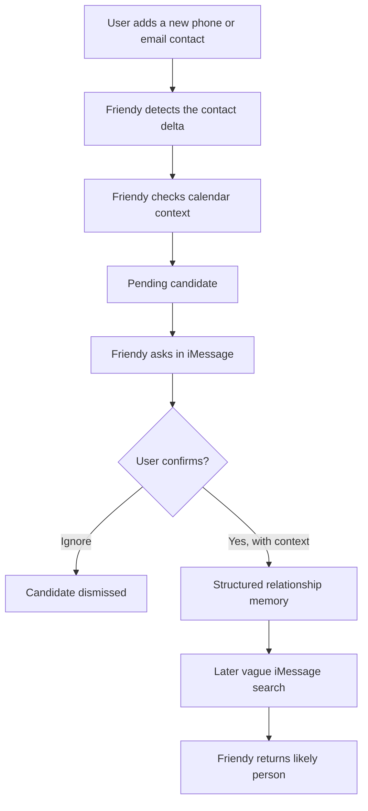

# Friendy

Friendy is an iMessage-first relationship memory agent. It helps you remember and refind people you meet by combining new contact signals, calendar context, user confirmation, structured memory, and natural-language search.

Photon/Spectrum is the communication transport. The product is the relationship agent.

## Current State

Friendy currently works as a local macOS-first prototype with deterministic verification paths.

What works today:

- Run the canonical foreground Mac MVP runtime with `npm run agent:friendy`.
- Check local runtime readiness with `npm run doctor:friendy`.
- Text the Spectrum/iMessage agent to save and search relationship memories.
- Detect newly added macOS Contacts when the explicit local checker runs.
- Map a new contact to nearby Apple Calendar events when an event is available.
- Ask for user confirmation before saving a detected contact as relationship memory.
- Handle no-event contact adds by asking where the user met the person.
- Share pending candidates and memories between the local checker and Spectrum runtime through optional local SQLite storage.
- Evaluate agent behavior with deterministic multi-turn relationship trajectories and the Mac MVP demo check.

What is not built yet:

- A macOS LaunchAgent or always-on background watcher.
- Signed `.app`, installer, or LaunchAgent packaging.
- LinkedIn, Instagram, X, or other social connection detectors.
- Face recognition, scraping, a CRM, or automatic memory creation without user confirmation.
- Production cloud sync or multi-user signup identity.

## Product Loop



The model can help interpret messy human text, but it does not directly mutate memory. Writes, ignores, corrected events, and searches go through deterministic tools.

## Quickstart

Install dependencies:

```bash
npm install
```

Run the core verification checks:

```bash
npm test
npm run build
npm run eval:agent
npm run check:mac-mvp-demo
```

Run safe product-flow checks that do not read real Contacts or send live iMessages:

```bash
npm run check:imessage-e2e
npm run ingest:check
npm run ingest:local:check -- --mock
```

## Canonical Mac MVP Runtime

Run the consolidated readiness check:

```bash
npm run doctor:friendy
```

Run with the fake sensor for deterministic local development:

```bash
FRIENDY_SENSOR_MOCK=1 FRIENDY_PROMPT_TRANSPORT=console npm run agent:friendy
```

Run the real Mac runtime after building the sensor:

```bash
npm run build:macos-sensor
npm run doctor:friendy
npm run agent:friendy
```

Friendy notices new contacts on your Mac and uses Calendar only to guess where you met them. It never reads your iMessages or scrapes social profiles, and it always asks before saving someone.

## Live iMessage Agent

Create `.env.local`:

```bash
cp .env.example .env.local
```

Required for live Spectrum and the temporary single-owner memory scope:

```bash
SPECTRUM_PROJECT_ID=
SPECTRUM_PROJECT_SECRET=
FRIENDY_AGENT_NUMBER=+14156056081
FRIENDY_OWNER_PHONE=+15550100000
```

Optional model-backed interpretation:

```bash
OPENROUTER_API_KEY=
OPENROUTER_MODEL=nvidia/nemotron-3-super-120b-a12b:free
```

If `OPENROUTER_API_KEY` is missing, Friendy uses the deterministic fallback interpreter so local checks still run.

Start the Spectrum/iMessage agent:

```bash
npm run agent:spectrum
```

Then text the Friendy agent number:

```text
+14156056081
```

Example messages:

```text
I met Amaya at Photon Residency II, and we talked about AI agents
Who did I meet at Photon Residency?
Who was the recruiting agents person?
```

## Local Contact And Calendar Checker

Run the deterministic local checker without macOS permissions:

```bash
npm run ingest:local:check -- --mock
```

Run the real macOS checker explicitly:

```bash
npm run ingest:local:check
```

First run behavior:

- Reads current macOS Contacts.
- Saves `.friendy/local-contact-snapshot.json`.
- Creates no candidates from existing contacts.
- Starts future checks from that baseline.

After the baseline exists:

1. Add a new contact in macOS Contacts with a phone number or email.
2. Run `npm run ingest:local:check` again.
3. Friendy compares the new snapshot against the baseline.
4. Friendy reads Apple Calendar around the contact change window.
5. Friendy creates a pending candidate and prints the confirmation prompt.

If a matching event is found:

```text
Friendy -> User: I noticed you added Friendy-101 during Photon Residency Dinner. Did you meet Friendy-101 there?
```

If no matching event is found:

```text
Friendy -> User: I noticed you added Friendy-101. Where did you meet them?
```

The checker is dry-run by default. It only sends a live iMessage prompt when explicitly enabled:

```bash
FRIENDY_LOCAL_CHECK_SEND=1 FRIENDY_LOCAL_CHECK_TO_PHONE=+15550100000 npm run ingest:local:check
```

If `FRIENDY_LOCAL_CHECK_TO_PHONE` is missing, Friendy falls back to `FRIENDY_OWNER_PHONE`.

## Shared Local Runtime State

Use local SQLite when the checker and Spectrum runtime need to share pending candidates, confirmed memories, ignored candidates, and interaction logs across separate processes.

Add this to `.env.local`:

```bash
FRIENDY_RUNTIME_STORE=sqlite
FRIENDY_SQLITE_PATH=.friendy/friendy.sqlite
FRIENDY_OWNER_PHONE=+15550100000
```

Run Spectrum in one terminal:

```bash
npm run agent:spectrum
```

Run the local checker in another terminal:

```bash
npm run ingest:local:check
```

To have the checker proactively text the confirmation prompt:

```bash
FRIENDY_LOCAL_CHECK_SEND=1 npm run ingest:local:check
```

The SQLite file lives under `.friendy/`, which is ignored by git because it contains local relationship-memory state. `FRIENDY_OWNER_PHONE` is the temporary single-owner identity that lets the checker and Spectrum runtime use the same memory scope before real signup exists.

## Commands

| Command | Purpose |
| --- | --- |
| `npm run dev` | Run the legacy local web shell. |
| `npm test` | Run unit and integration tests. |
| `npm run build` | Type-check and build the Vite app. |
| `npm run eval:agent` | Run deterministic multi-turn relationship-agent evals. |
| `npm run check:mac-mvp-demo` | Run the deterministic Mac MVP capture/recall/correction demo check. |
| `npm run doctor:friendy` | Check local Mac MVP runtime readiness without starting Spectrum or the sensor. |
| `npm run agent:friendy` | Run the canonical foreground Mac MVP runtime. |
| `npm run agent:terminal -- "..."` | Run a local terminal agent path without Spectrum credentials. |
| `npm run agent:spectrum` | Run the live Spectrum/iMessage transport. |
| `npm run check:imessage-e2e` | Run deterministic iMessage-style contact confirmation and search flow. |
| `npm run ingest:check` | Run fixture contact/calendar ingestion. |
| `npm run ingest:local:check -- --mock` | Run local checker with deterministic mock data. |
| `npm run ingest:local:check` | Explicitly read real macOS Contacts and Calendar. |
| `npm run ingest:contacts:smoke -- --name Friendy-001` | Create or reuse one guarded macOS Contacts test contact. |

## Agent Behavior

Friendy supports two main interaction modes.

Manual memory capture:

```text
You: I met Sarah Fah at Photon Residency II. She ran the community.
Friendy: Got it, saved Sarah Fah from Photon Residency II. I'll remember she ran the community.
```

Detected contact confirmation:

```text
Friendy: I noticed you added Maya Chen during Photon Residency Dinner. Did you meet Maya Chen there?
You: yes, actually at Photon Residency, recruiting agents
Friendy: Got it, saved Maya Chen from Photon Residency. I'll remember recruiting agents.
```

Search:

```text
You: who was the recruiting agents person from Photon?
Friendy: I think that was Maya Chen.
```

Friendy also carries recent event context across follow-up messages:

```text
I met Amaya at Photon Residency II
I also met Sarah Fah who ran the community
And Felix Ng from UBC was in the same room
Who did I meet at Photon Residency II?
```

Date phrases are parsed with `chrono-node`, so messages such as `yesterday`, `today`, or `last week` store both the raw phrase and normalized date context.

## Architecture

Treat [Friendy AI System Architecture](docs/ai-system-architecture.md) as the canonical architecture source. This README is the quickstart and operator guide.

Current source map:

```text
src/relationship/transports/
  Spectrum/iMessage and terminal adapters

src/relationship/ingestion/
  contact snapshot diffing, fixture ingestion, and explicit local macOS checker

src/relationship/interpretation.ts
src/relationship/openRouterInterpreter.ts
  structured intent schema and optional OpenRouter interpreter

src/relationship/interpretedAgent.ts
  conversation context carryover and interpreted execution

src/relationship/env.ts
src/relationship/identity.ts
  local environment loading and temporary single-owner identity resolution

src/relationship/tools.ts
src/relationship/repository.ts
src/relationship/sqliteRepository.ts
src/relationship/runtimeRepository.ts
  deterministic tools and memory persistence boundary

src/relationship/responseComposer.ts
  short user-facing iMessage replies

src/relationship/evals/
  trajectory-level behavior evaluation
```

## Evaluation

The required eval suite is deterministic and runs without OpenRouter credentials:

```bash
npm run eval:agent
```

It currently covers:

- clear-event contact confirmation
- overlapping-event correction
- no-event confirmation
- ignored candidates
- post-confirmation search
- vague-search clarification
- event-wide recall
- context carryover
- hallucination guard
- unsafe-save guard
- Spectrum first-inbound identity
- messy human wording

Metrics include pass rate, intent accuracy, memory-write correctness, search recall@3, unsafe mutation count, hallucination count, and clarification correctness.

Optional repeated model-backed evals require:

```bash
OPENROUTER_API_KEY=
FRIENDY_EVAL_RUN_MODEL=1
```

## Privacy And Safety

Friendy should feel like a personal memory assistant, not surveillance.

Current guardrails:

- Real Contacts and Calendar reads only happen through explicit local commands.
- The local checker starts with a baseline and does not import all existing contacts.
- Detected contacts become pending candidates, not saved memories.
- User confirmation is required before a detected candidate becomes relationship memory.
- Live checker sending requires `FRIENDY_LOCAL_CHECK_SEND=1`.
- `.friendy/` local state and `.env.local` secrets are ignored by git.

## Docs

- [AI system architecture](docs/ai-system-architecture.md)
- [Product spec](docs/product-spec.md)
- [Product flow plan](docs/product-flow-plan.md)
- [Changelog](CHANGELOG.md)
- [System audit snapshot](docs/reviews/current-system-audit.md)
- [Agent navigation](docs/agent-navigation.md)
- [Handoff](docs/handoff.md)
- [Codex access setup](docs/codex-access.md)
- [Superpowers planning artifacts](docs/superpowers/README.md)

## Legacy Local Web Shell

The Vite web app still exists as a local UI sanity check, but it is not the current product center. The current MVP is the iMessage-first relationship system under `src/relationship/`.

Run it with:

```bash
npm run dev
```

## Product Direction

The next product milestone is a foreground local runtime:

```bash
npm run agent:friendy
```

That command should run Spectrum and the contact/calendar checker together so the user can start Friendy once, add contacts, receive iMessage confirmation prompts, and search later without manually running separate commands.
