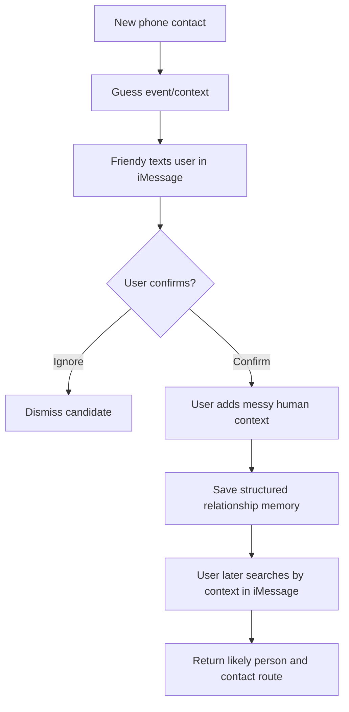

# Friendy

Friendy is an iMessage-first relationship memory agent, built on Photon/Spectrum, that helps you remember and refind people you met during approved event windows.

The current version is a local prototype. It uses deterministic fixture signals for repeatable checks and now has an explicit macOS local checker for real Contacts/Calendar reads when the user runs the command.

## MVP Loop

1. Friendy notices an upcoming event from a calendar feed.
2. The Photon-style agent asks whether to remember new people during that event.
3. The user approves the memory window.
4. Contact deltas appear after the event.
5. The agent asks the user to confirm which contacts were actually met.
6. The user adds context in natural language.
7. Later, the user can ask vague recall questions like `who was playing piano at dinner?`.

## How The AI System Works

Friendy is an AI system, not just an LLM call. The system combines contact signals, event context, iMessage conversation, structured interpretation, deterministic tools, relationship memory, search, response composition, and evals.

The product loop:



The current architecture flow:

```mermaid
flowchart LR
  A[Contact snapshot diff] --> B[New phone/email method]
  B --> C[detectedAt from snapshot]
  C --> D[Calendar event match]
  D --> E[Pending contact candidate]
  E --> F[iMessage confirmation prompt]
  F --> G[User reply]
  G --> H[Structured interpretation]
  H --> I[Deterministic tool call]
  I --> J[Relationship memory]
  J --> K[Later fuzzy search]
  K --> L[Composed iMessage response]
```



The model may help interpret messy user language, but it does not directly mutate memory. State changes go through deterministic tools for confirmation, memory writes, ignores, event corrections, and searches.

Friendy also separates context that humans often blend together:

- `eventContext`: where or when this interaction happened.
- `relationshipContext`: prior history or backstory.
- `userNote`: the user's raw or lightly cleaned memory.
- `contactMethod`: how to reach the person.

Example:

```text
met abc at Photon Residency II after havent met him since high school in minnesota
```

Friendy should treat `Photon Residency II` as the current event and `high school in Minnesota` as relationship backstory, not confuse the two.

See [Friendy AI System Architecture](docs/ai-system-architecture.md) for the full system boundary, current limitations, and next milestone.

## Docs

- [Product spec](docs/product-spec.md)
- [AI system architecture](docs/ai-system-architecture.md)
- [Changelog](CHANGELOG.md)
- [Product Flow plan](docs/product-flow-plan.md)
- [Handoff](docs/handoff.md)
- [Codex access setup](docs/codex-access.md)
- [Contact-event verification product flow transcript](docs/goals/contact-event-verification-queue.md)
- [Original Superpowers planning artifacts](docs/superpowers/README.md)

## Explicit Non-Goals For V1

- No iMessage reading.
- No Instagram, LinkedIn, or X scraping.
- No face recognition.
- No full CRM workflow.
- No automatic identity graph.
- No real iOS background contact monitoring yet.

## Getting Started

```bash
npm install
npm run dev
```

Run checks:

```bash
npm test
npm run build
npm run eval:agent
npm run check:imessage-e2e
npm run ingest:check
npm run ingest:local:check -- --mock
```

## Product Flow Script

In the chat UI:

1. Send `yes`.
2. Confirm the candidate queue shows Maya, Alex, and Priya.
3. Send `save Maya: played piano, AI recruiting founder`.
4. Confirm saved memories show Maya.
5. Send `who was playing piano at dinner`.
6. Friendy should return Maya with the saved context in a human-sounding reply.

## Relationship Agent Core

Run the local terminal agent product flow:

```bash
npm run agent:terminal -- "yes, recruiting agents, played piano"
```

The iMessage/Spectrum agent also accepts natural save messages such as:

```text
I met Amaya at Photon Residency II, and we talked about AI agents
```

Then search with:

```text
who did I meet at Photon Residency?
```

Queued contact confirmations stay deterministic:

```text
new contact detected during Photon Residency Dinner
Friendy: I noticed you added Maya Chen during Photon Residency Dinner. Did you meet Maya Chen there?
You: yes, actually at Photon Residency, recruiting agents
Friendy: Saved Maya Chen. I'll remember: recruiting agents.
You: who was the recruiting agents person from Photon?
Friendy: I think that was Maya Chen...
```

Friendy also carries recent event context across follow-up messages:

```text
I met Amaya at Photon Residency II, and me and him sleep on the same bed cuz we ran out of bed :(
I also met Sarah Fah who ran Photon Residency II as the community lead
And also met Felix Ng who goes to UBC and sleep in the same room with me and Amaya
Who did I meet at Photon Residency II?
```

Date phrases are parsed with `chrono-node` against the inbound message timestamp and configured user timezone, so messages like `I met Maya yesterday at Photon Residency II dinner` store both the raw phrase and a normalized date.

Search and save replies are composed through `src/relationship/responseComposer.ts`. The search tools still choose matches deterministically, but user-facing replies avoid raw phrases such as `matched:`, internal reason strings, and placeholder labels like `manual contact`.

Search ranking is field-aware: narrow queries such as `Find the recruiting agents founder from Photon` prefer role/project/context matches over broad event overlap, while broad event queries such as `Who did I meet at Photon Residency II?` still list everyone from that event.

Run the relationship-agent eval harness:

```bash
npm run eval:agent
```

The required eval set is deterministic and runs without OpenRouter credentials. It scores 12 realistic trajectories across contact confirmation, event correction, no-event confirmation, ignore, post-confirmation search, clarification, event-wide recall, context carryover, hallucination guard, unsafe-save guard, Spectrum first-inbound identity, and messy human wording. Metrics include pass rate, intent accuracy, memory-write correctness, search recall@3, unsafe mutation count, hallucination count, and clarification correctness. Optional repeated model-backed evals are gated behind `OPENROUTER_API_KEY` and `FRIENDY_EVAL_RUN_MODEL=1`.

## iMessage Contact Confirmation Product Flow

Run the deterministic iMessage/Spectrum-style E2E product flow:

```bash
npm run check:imessage-e2e
```

The product flow uses fixture contact/calendar ingestion, then routes the user's confirmation and later search through the same Spectrum/iMessage runtime boundary used by the live agent. It does not send real iMessages.

Expected shape:

```text
Detected contact: Abc
Best event guess: Photon Residency II
Friendy -> User: I noticed you added Abc around Photon Residency II. Did you meet them there?
User -> Friendy: yes, met abc at Photon Residency II after havent met him since high school in minnesota
Saved memory: Abc
Event context: Photon Residency II
Relationship backstory: had not seen him since high school in Minnesota
User -> Friendy: who did I run into from high school at Photon?
Friendy -> User: I think that was Abc
```

## Contact/Calendar Ingestion Product Flow

Run the fixture-only ingestion product flow:

```bash
npm run ingest:check
```

The product flow uses checked-in before/after contact snapshots and fixture calendar events. It prints a deterministic summary with detected contacts, candidate ids, event guesses, and the pending queue. It does not read real Contacts or real calendars.

Expected shape:

```text
Detected contacts: Maya Chen, Nina Park
Candidate candidate_maya_chen_1778906520000: Maya Chen
Event guesses: 1. Photon Residency Dinner | 2. Photon Residency
Candidate candidate_nina_park_1780340400000: Nina Park
Event guesses: none
Pending queue: Maya Chen, Nina Park
```

Optional macOS Contacts smoke test:

```bash
npm run ingest:contacts:smoke -- --name Friendy-001
```

This command is explicit and is never run by `npm test`, `npm run build`, `npm run eval:agent`, or `npm run ingest:check`. It only accepts names matching `Friendy-<number>`, creates or reuses that exact test contact, and prints the exact name and phone method it created or reused. On non-macOS environments it fails clearly while fixture ingestion continues to work.

To manually delete a smoke-test contact, open the macOS Contacts app, search for the exact test name such as `Friendy-001`, select that contact, and delete it.

## Local macOS Contact/Calendar Checker

Run the deterministic local checker path without real macOS permissions:

```bash
npm run ingest:local:check -- --mock
```

This exercises the same path the real local checker uses: contact snapshot diff, calendar event match, pending candidate creation, and Friendy confirmation prompt output. It does not send a live iMessage.

On macOS, run the real explicit local check:

```bash
npm run ingest:local:check
```

The first run saves a baseline snapshot at `.friendy/local-contact-snapshot.json`. After that, add a test contact named like `Friendy-101` with a phone number or email, then run the command again. Friendy compares the new Contacts snapshot against the baseline, reads Apple Calendar events around the detection window, maps the new contact method to the best event, creates a pending candidate, and prints the confirmation prompt.

The command is dry-run by default. Live Spectrum sending requires all normal Spectrum credentials plus an explicit send flag:

```bash
FRIENDY_LOCAL_CHECK_SEND=1 FRIENDY_LOCAL_CHECK_TO_PHONE=+15550100000 npm run ingest:local:check
```

If `FRIENDY_LOCAL_CHECK_TO_PHONE` is missing, Friendy falls back to `FRIENDY_OWNER_PHONE`. On non-macOS environments, real-provider mode fails clearly and points to the mock command so fixture checks still work.

Run the Spectrum/iMessage agent when Spectrum credentials are available:

```bash
# .env.local is supported for local credentials and is ignored by git.
cp .env.example .env.local
npm run agent:spectrum
```

The agent number for the first iMessage channel is `+14156056081`.

Configure the LLM interpreter in `.env.local`:

```bash
SPECTRUM_PROJECT_ID=
SPECTRUM_PROJECT_SECRET=
FRIENDY_AGENT_NUMBER=+14156056081
OPENROUTER_API_KEY=
OPENROUTER_MODEL=nvidia/nemotron-3-super-120b-a12b:free
```

`OPENROUTER_API_KEY` is optional for local testing. If it is missing, Friendy falls back to a deterministic interpreter so the MVP examples still run without model access. When OpenRouter is configured, the model only returns validated structured intent JSON; deterministic backend tools still perform all memory writes and searches.

Live iMessage smoke test:

```text
I met Amaya at Photon Residency II, and me and him sleep on the same bed cuz we ran out of bed :(
Who did I meet at the residency?
Ok so at the residency, I also met Zhiyuan who also call zed, go to CMU, class 2028 and making swift project that allow you to control your computer through your phone with a clicky UI and similar function like Wisper Flow
Who was making the Swift project?
that person from the thing
```

## Product Direction

Friendy should stay agent-centric. A future mobile companion app can provide Contacts and Calendar signals, but the user-facing product is the Photon agent that asks, confirms, remembers, searches, explains, and helps follow up.
