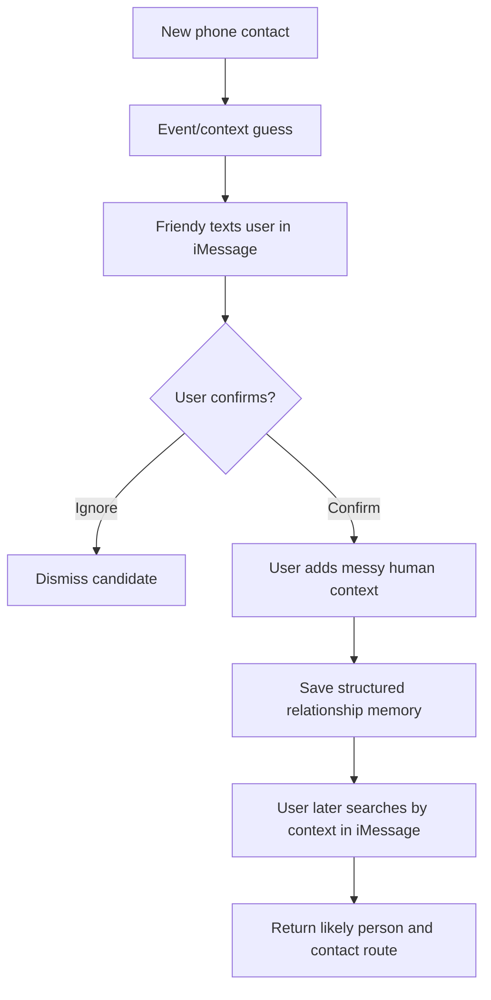
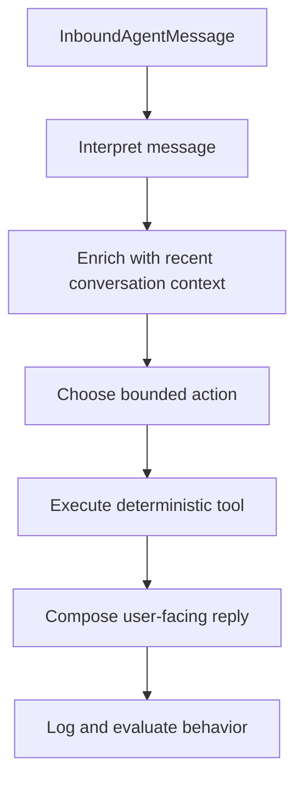
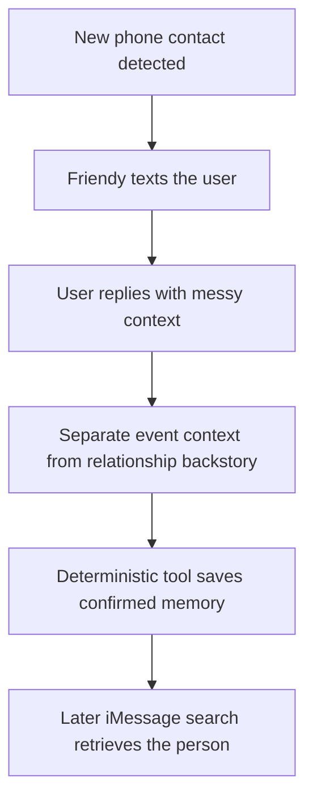

# Friendy AI System Architecture

## Definition

This is the canonical architecture document for Friendy. `README.md` should stay a quickstart/operator guide, `REFERENCE.md` should stay the repo navigation map, and `CHANGELOG.md` should stay historical.

An AI system is a product system where models, tools, memory, state, interfaces, rules, and evaluations work together to turn uncertain human input or external signals into useful actions.

Friendy is an iMessage-first relationship memory AI system. The LLM is not the whole system. The system is the loop that detects relationship signals, asks the user for consent and context, stores structured memory, and retrieves the right person later from vague human recall.

## Product Loop



The MVP focuses on phone contacts as the first connection source and iMessage as the only primary communication surface. LinkedIn, X, Instagram, and other connection sources can become future detectors, but they are not part of the current MVP.

## System Boundary

These parts count as Friendy's AI system:

- Spectrum/iMessage transport for the user conversation.
- Contact/calendar ingestion for detecting likely new relationship events.
- Message normalization into a stable inbound message shape.
- Interpretation layer that converts messy text into structured intent.
- Deterministic tools for confirmation, memory writes, ignores, search, and event-match lookup.
- Relationship memory repository.
- Search and ranking over names, events, notes, roles, projects, schools, aliases, dates, and contact labels.
- Response composer for short human-facing iMessage replies.
- Eval harness for messy multi-turn agent trajectories.
- Privacy and consent guardrails.

These parts are outside the current MVP:

- LinkedIn, X, Instagram, or website scraping.
- Face recognition.
- Full CRM workflows.
- Multi-channel communication as a product focus.
- Automatic memory creation without user confirmation.
- Production durable storage and mobile background execution.

## Current Architecture Flow

```mermaid
flowchart LR
  A[Contact snapshot diff] --> B[New phone/email method]
  B --> C[detectedAt from snapshot data]
  C --> D[Calendar event match]
  D --> E[Pending contact candidate]
  E --> F[iMessage confirmation prompt]
  F --> G[User reply]
  G --> H[Interpreted intent]
  H --> I[Deterministic tool call]
  I --> J[Relationship memory]
  J --> K[Later fuzzy search]
  K --> L[Composed iMessage response]
```



Today, ingestion has two safe paths in the repo. Fixture checks keep the core behavior deterministic, and the explicit local macOS checker can read real Contacts/Calendar only when `npm run ingest:local:check` is run. The important architectural boundary is covered by `npm run check:imessage-e2e` and the local checker: contact detection creates pending candidates, and the iMessage/Spectrum-style agent flow confirms or ignores those candidates before memory is saved.

## Agent Loop



The model may help interpret messy language, but it should not directly mutate memory. Writes, ignores, event corrections, and searches go through explicit deterministic tools so the system can be tested and audited.

## Memory Model

Friendy needs to separate facts that humans often blend together in one sentence:

- `eventContext`: where or when the current interaction happened.
- `relationshipContext`: prior history, backstory, or how the user already knew the person.
- `userNote`: the user's raw or lightly cleaned memory note.
- `contactMethod`: the route back to the person, such as phone, iMessage, email, or future social links.
- `detectedAt`: when the contact signal appeared.
- `confirmedAt`: when the user approved saving the relationship memory.

This separation matters because event context and relationship backstory can point to different times and places.

## Important Parsing Example

User says:

```text
met abc at Photon Residency II after havent met him since high school in minnesota
```

Friendy should understand:

- Current interaction/event: `Photon Residency II`
- Person: `abc`
- Relationship backstory: `had not seen him since high school in Minnesota`
- Searchable note: `Met again at Photon Residency II after not seeing him since high school in Minnesota`

Friendy should not treat `high school in Minnesota` as the current event. It is prior relationship context.

## Current Repo Implementation

```text
src/relationship/transports/
  iMessage/Spectrum and terminal adapters

src/relationship/ingestion/
  fixture contact snapshot diffing, fixture calendar ingestion, and explicit local macOS Contacts/Calendar checker

src/relationship/interpretation.ts
src/relationship/openRouterInterpreter.ts
  structured message interpretation contract and optional LLM-backed interpreter

src/relationship/interpretedAgent.ts
  conversation context carryover and interpreted execution

src/relationship/tools.ts
src/relationship/repository.ts
  deterministic tool and memory boundary

src/relationship/sqliteRepository.ts
src/relationship/runtimeRepository.ts
  optional local durable runtime store behind the repository boundary

src/relationship/responseComposer.ts
  user-facing response wording

src/relationship/evals/
  deterministic trajectory-level agent evaluation
```

## Design Principles

- iMessage is the primary communication surface for the MVP.
- New phone contacts are the first detection source.
- Every detected person starts as a pending candidate, not a saved memory.
- User confirmation is required before saving a relationship memory.
- The agent should ask when uncertain instead of inventing details.
- Deterministic tools own state changes.
- LLM interpretation is useful, but bounded and replaceable.
- Evals should test whole relationship trajectories, not only single functions.

## Current Limitations

- Contact detection is deterministic for fixture checks and explicit-command-only for real local macOS reads.
- Real Contacts access exists only in explicit local commands: the Contacts smoke command and the local macOS contact/calendar checker.
- The real local checker is explicit command-line tooling, not a background watcher or mobile production detector.
- Calendar matching can use fixture events or the explicit local Apple Calendar adapter, but durable production calendar sync is not implemented.
- Runtime state can use the in-memory repository for deterministic checks or the optional SQLite repository for local cross-process persistence. SQLite is still local development storage, not production cloud sync.
- Spectrum/iMessage is wired as the primary live transport, and `npm run check:imessage-e2e` exercises a deterministic local Spectrum/iMessage-style path without sending live messages.
- LinkedIn, X, Instagram, and other social connection sources are future detectors, not MVP requirements.
- The system does not yet run a real background watcher that notices a new phone contact and proactively sends a live iMessage.

## Next MVP Milestone

The deterministic iMessage-first contact confirmation loop now runs locally:



The product flow should prove this product behavior before adding more connection sources or a richer UI.

The next production milestone is turning the explicit local checker into an approved user-controlled contact/calendar signal source while keeping the same pending-candidate and iMessage confirmation boundary.
